# Interaktivní mapa cest Hanzelky a Zikmunda 🗺️🚗📷

Tento projekt poskytuje interaktivní webovou aplikaci a mapovou vizualizaci cest legendárních československých cestovatelů **Jiřího Hanzelky** a **Miroslava Zikmunda**.

Mapa zachycuje kompletní trasu obou jejich nejslavnějších výprav po světě včetně historických detailů, fotografií, popisu zastávek a specifikací vozidel.

---

## 🌟 Hlavní funkce aplikace

- **První výprava (1947–1950)**:
  - Trasa napříč Afrikou, Jižní a Střední Amerikou ve stříbrném proudnicovém voze **Tatra 87**.
  - Zahrnuje ikony jako Casablanca, Cheopsovu pyramidu v Gíze, Kilimandžáro, Viktoriiny vodopády, Kapské Město, Machu Picchu a další.
- **Druhá výprava (1959–1964)**:
  - Trasa přes Blízký východ, Asii, Oceánii, Japonsko a Sovětský svaz ve dvou terénních speciálech **Tatra 805**.
  - Obsahuje zastávky v Istanbulu, Tádž Mahalu, na Bali, Fudži či u zimního jezera Bajkal.
- **Interaktivní mapa (Leaflet.js)**:
  - Barevně odlišené linie tras a vlastní značky zastávek.
  - Vyskakovací okna (popups) s popisem událostí a historickými fotografiemi.
- **Interaktivní časová osa a přehrávač cesty**:
  - Tlačítko pro automatické animované procházení zastávek krok za krokem.
- **Filtrace a vyhledávání**:
  - Filtrování podle konkrétní expedice nebo vyhledávání konkrétních měst, zemí či dat.
- **Historický kontext a galeriový prohlížeč**:
  - Informační okno o Hanzelkovi a Zikmundovi i podrobných technických parametrech vozů Tatra 87 a Tatra 805.

---

## 🚀 Jak aplikaci spustit lokálně

Aplikace nevyžaduje žádné složité buildovací nástroje ani závislosti. Stačí mít jakýkoliv lokální webový server.

### Možnost A: Python HTTP Server

```bash
# V kořenovém adresáři projektu spustit:
python3 -m http.server 8000
```
Poté otevřete ve svém prohlížeči adresu: `http://localhost:8000`

### Možnost B: Node.js http-server / npx

```bash
npx http-server -p 8000
```

---

## 📂 Struktura projektu

```text
.
├── index.html              # Hlavní HTML struktura aplikace
├── css/
│   └── styles.css          # Moderní CSS styly a responzivní rozvržení
├── js/
│   └── app.js              # Logika mapy Leaflet, filtry, časová osa
├── data/
│   └── journeys.json       # Geografická data zastávek, popisky, fotky
├── images/
│   └── photos/             # Historické fotografie z výprav
├── /home/jules/self_created_tools/
│   └── validate_journey_data.py # Skript pro validaci formátu dat
└── README.md               # Dokumentace
```

---

## 🌐 Publikování na GitHub Pages

Projekt je navržen tak, aby jej bylo možné okamžitě nasadit zdarma na **GitHub Pages**:

1. Nahrajte tento repozitář na váš GitHub účet.
2. V nastavení repozitáře (**Settings -> Pages**) vyberte jako zdroj větev `main` (nebo `master`) a složku `/ (root)`.
3. Během několika sekund bude vaše mapa dostupná online na adrese: `https://<vase-jmeno>.github.io/<nazev-repozitare>/`.

---

## 🗺️ Přidané fotografie ke klíčovým zastávkám v Africe (Tatra 87)

- **Casablanca (Maroko)**
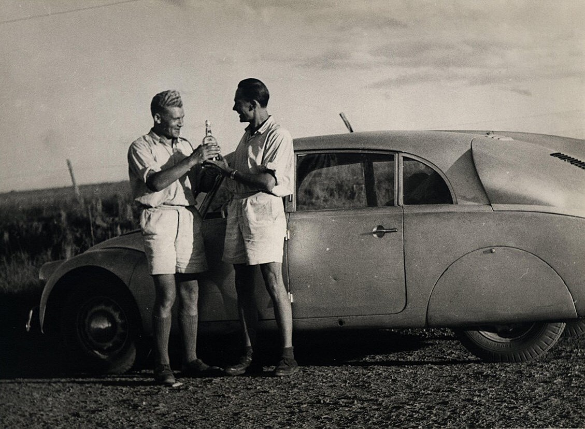

1. **Průjezd Atlasem a skalnatými kaňony v Severní Africe**
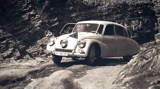

2. **Průjezd Saharou a vyprošťování auta ze závějí písku**
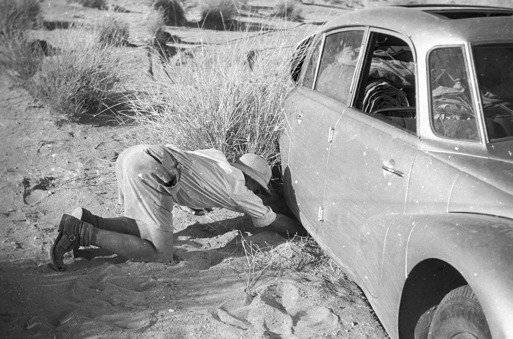

- **Káhira a Gíza (Egypt)**
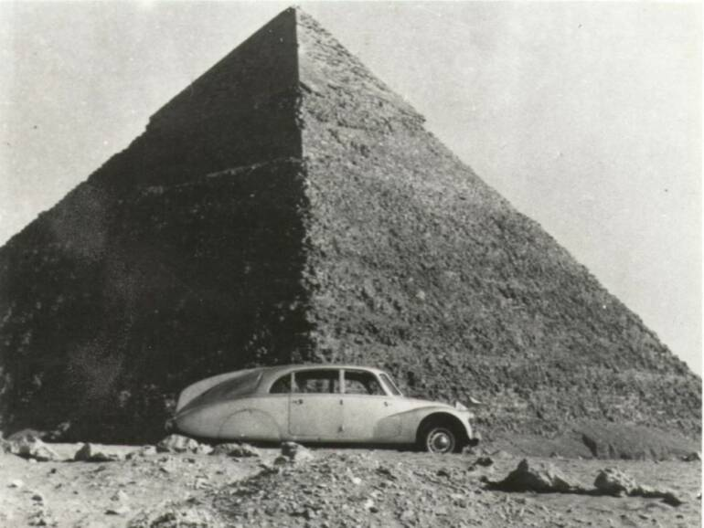

3. **Ostrý kamenný terén a pouštní reg**
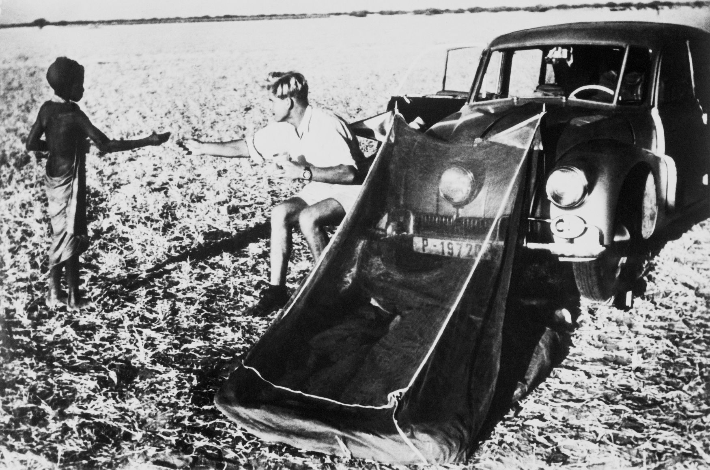

4. **Nocování v savaně / setkání s místními obyvateli u auta s moskytiérou**
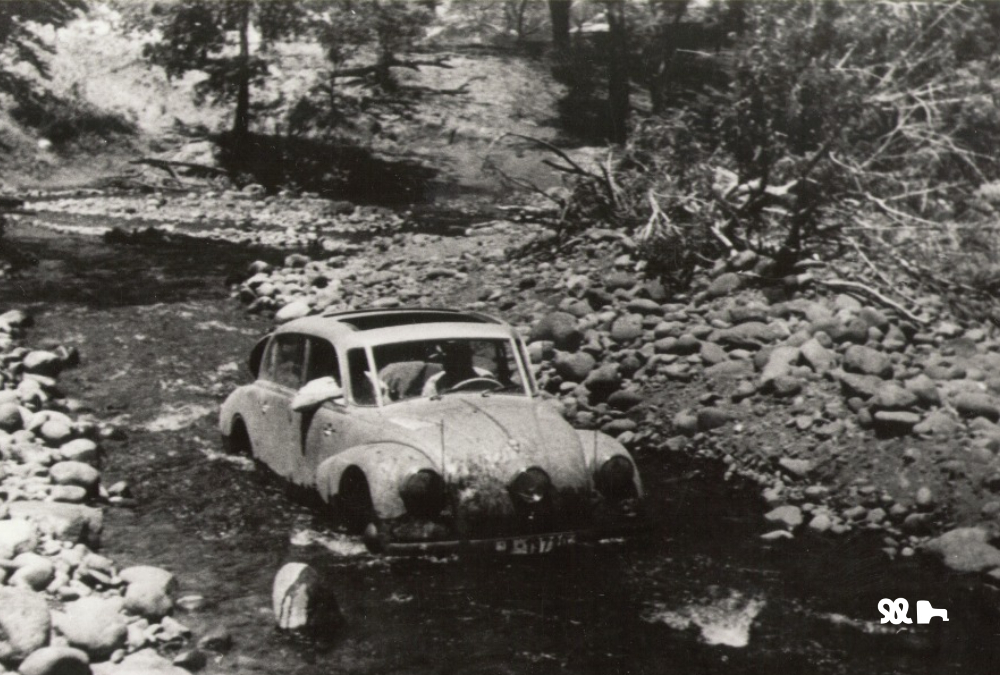

5. **Přebrodění řeky a kamenitého koryta v buši**
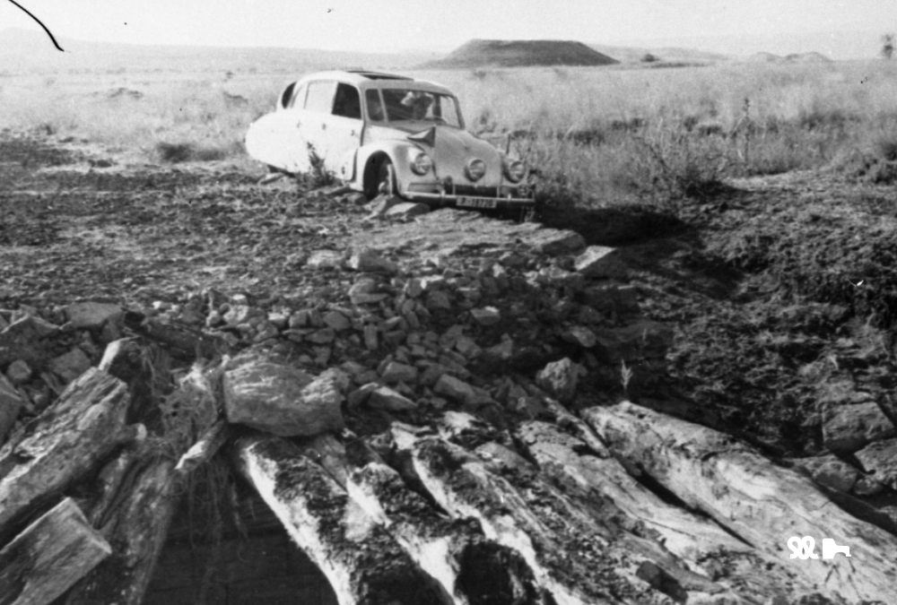

6. **Průjezd pralesem a setkání s kmenem Pygmejů ve Střední Africe**
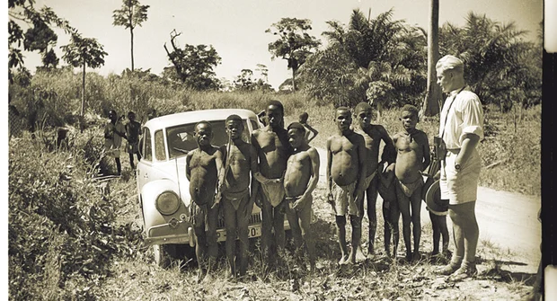

- **Kapské Město (Jihoafrická republika)**
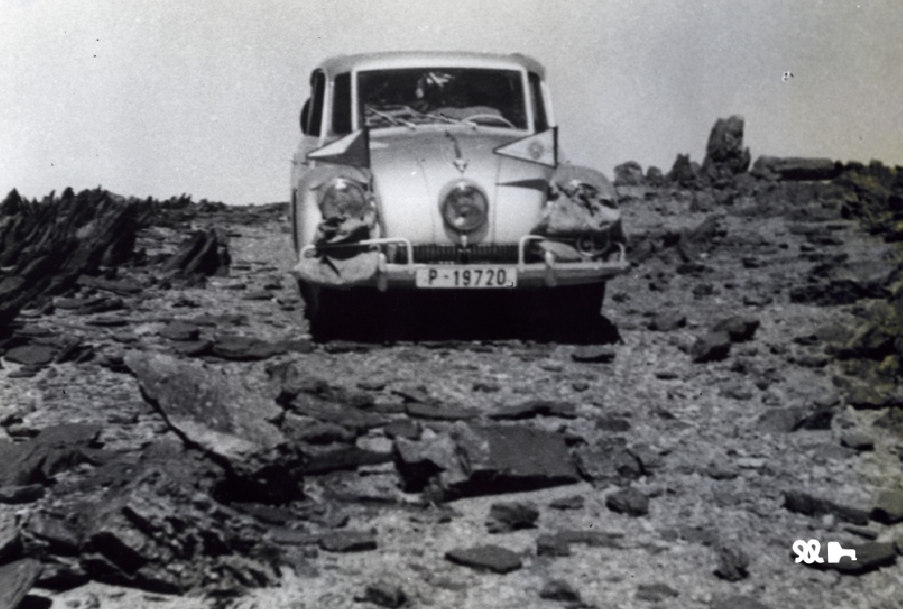

---

## 🗺️ Přidané fotografie ke zastávkám v Jižní a Střední Americe (Tatra 87)

- **Rio de Janeiro (Brazílie)**
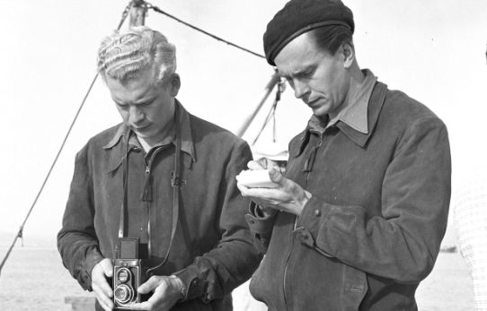

- **Buenos Aires (Argentina)**


- **San Carlos de Bariloche (Argentina)**


- **Santiago de Chile (Chile)**
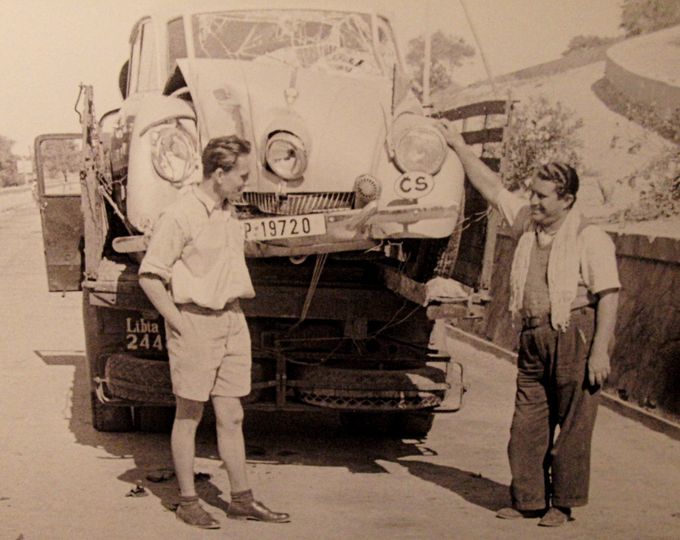

- **La Paz a Jezero Titicaca (Bolívie)**


- **Machu Picchu a Lima (Peru)**


- **Quito (Ekvádor)**
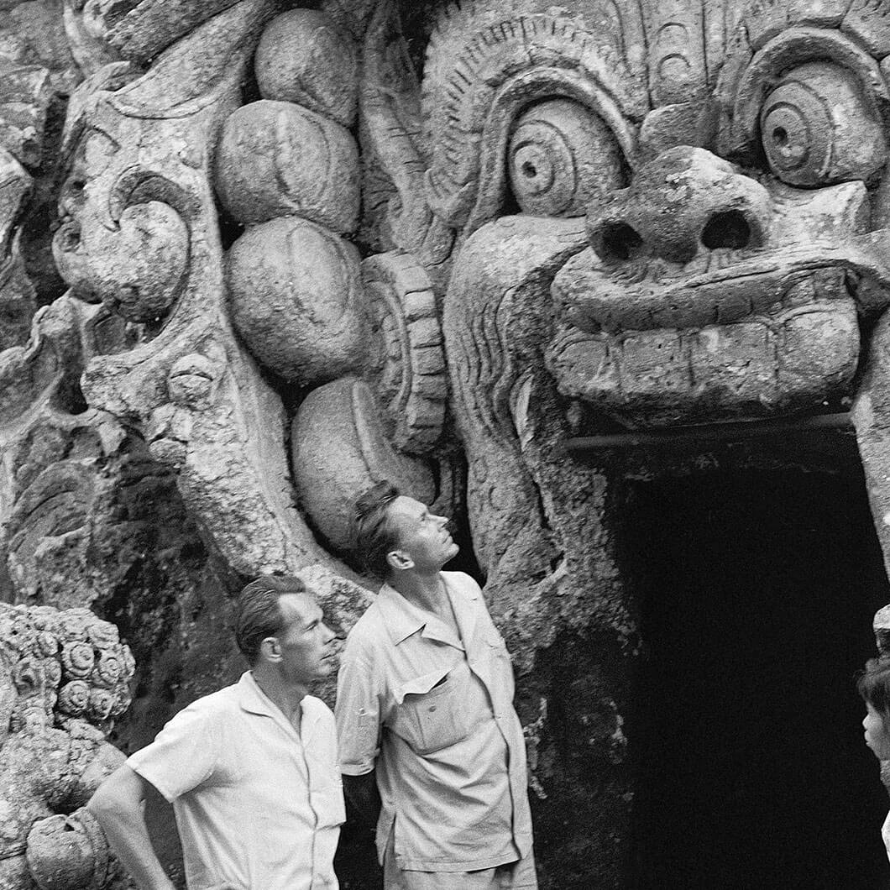

- **Bogota (Kolumbie)**
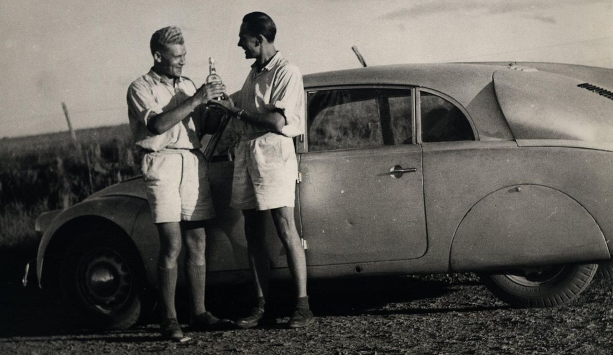

- **Panama City (Panama)**
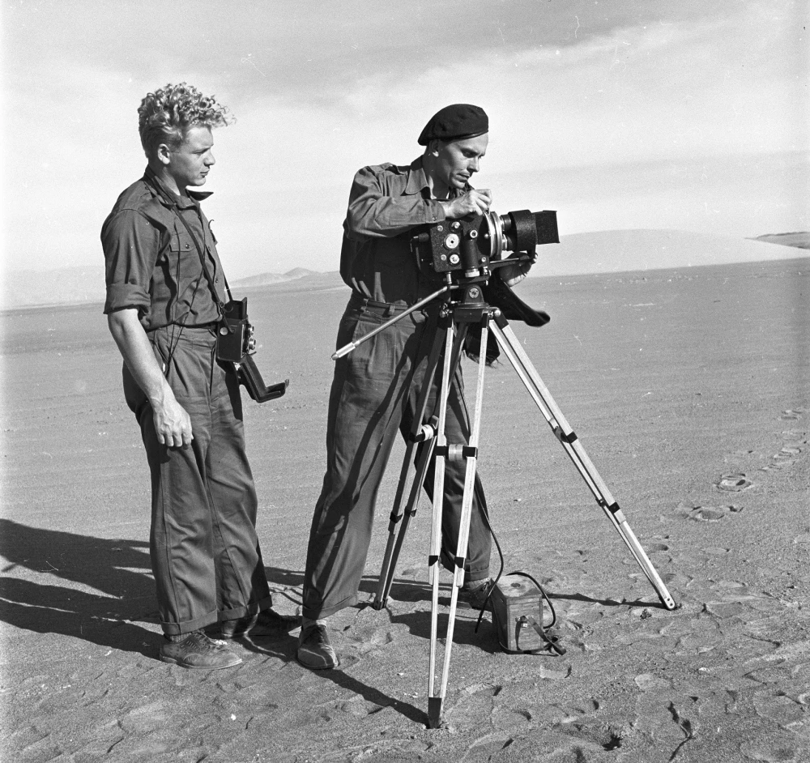

---

## 📷 Licenční informace k fotografiím

Použité fotografie pocházejí z volně přístupných zdrojů Wikimedia Commons v souladu s licencemi Creative Commons a Public Domain.
